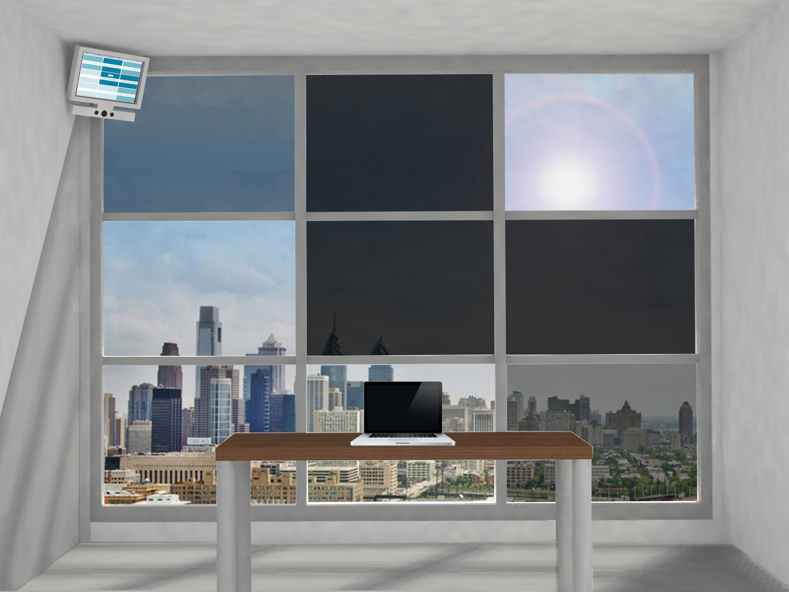

DarrenCursorMulti
=================

Kinect + Arduino feature enabled WPF C# Application



### History

This project is a collaboration between Architects, designers, and facade technologies. 
A Microsoft Kinect is used to add human gestural interaction to a piece of electrochromic (EC) glazing.
EC Glazing is traditionally controlled with a switch to change the tint of the system, or automated by external variables.
Using an Arduino, human control can be implemented without ever physically touching the EC glazing. No switches needed.

http://soa.utexas.edu/work/electro-chromic-glazing-enhanced-tool-modulating-interior-sensory-conditions

### Intent

Originally this project was intended for the primary use stated above.
However, as the application developed, I realized this was a nice basic framework.
Arduino + Kinect are simple interfaces to use but can be clunky with Visual Studio. 
This would be extremely helpful to people trying to create interactive spaces, especially now that Arduino and Kinect are becoming mainstream and economically viable.
Please note that the included Arduino code is specific to this project. Do not use given voltage values or configurations unless an electric circuit is properly designed for use. Please contact me if you are interested in the circuit used for this project.

### Usage

These are the parameters that need to be enabled once you have connected a Microsoft Kinect to your computer.
InitializeComponent and Loaded are disabled by default as mouse input is also acceptable.
Kinect is treated as a mouse for this application but sliders, buttons, and interfaces can be added via normal Kinect implementation.
```
//InitializeComponent();
//Loaded += OnLoaded;
```

Arduino also disabled by default, uncomment arduino.Open() and the if statement when plugging an arduino in, COM port and Baud rates may be different.
```
arduino.PortName = "COM3";
arduino.BaudRate = 9600;
//arduino.Open();
//if(arduino.IsOpen && state[p]==4) {char[] fourth = {state[4]}; arduino.Write(fourth, 0, 1);}
```
The last line is particularly critical, currently only the center pane of glass [4] is working as I only have one SageGlass sample.
Further implementation is to be added once more panels arrive via donation.
Special thanks to SageGlass for donating a demo sample of EC glazing.
